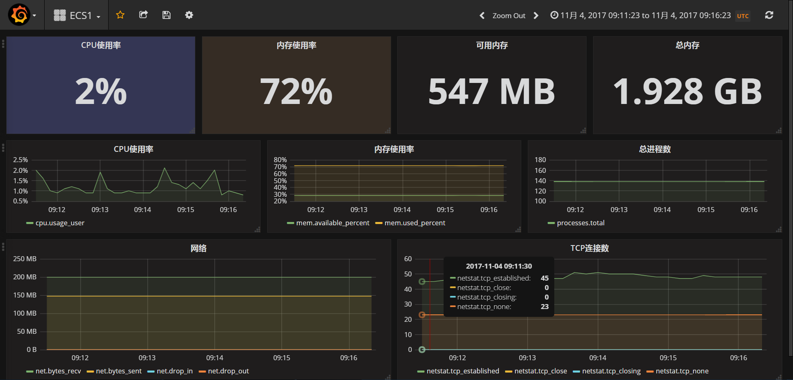
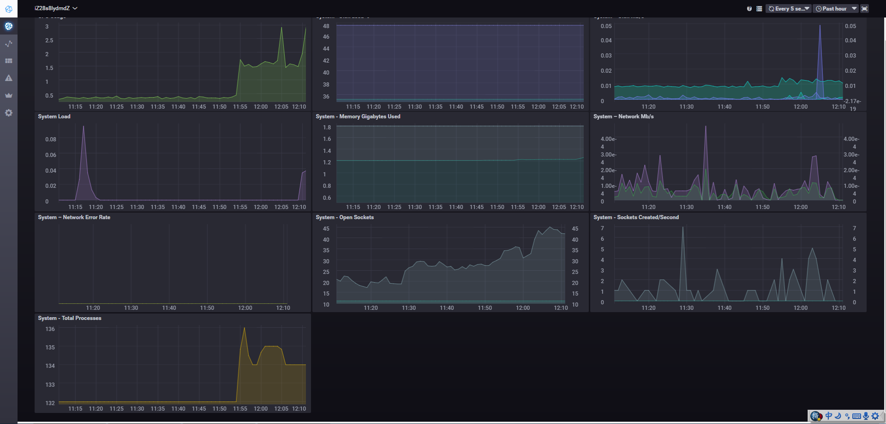

### 0. 最终效果图





### 1. 下载和安装telegraf influxdb chronograf等工具
参考：https://docs.influxdata.com/telegraf/v1.4/introduction/installation/

```shell
touch /etc/yum.repos.d/influxdb.repo
vi /etc/yum.repos.d/influxdb.repo
输入一下内容
[influxdb]
  name = InfluxDB Repository - RHEL \$releasever
  baseurl = https://repos.influxdata.com/rhel/\$releasever/\$basearch/stable
  enabled = 1
  gpgcheck = 1
  gpgkey = https://repos.influxdata.com/influxdb.key
  
sudo yum install telegraf
sudo yum install influxdb
sudo yum install chronograf
 
sudo systemctl start telegraf.service
sudo systemctl start influxdb.service
sudo systemctl start chronograf.service
```

关注：influxdb 8086端口  关注 chronograf 8888端口

修改完成后测试一下：
```shell
telegraf -config /etc/telegraf/telegraf.conf -test
systemctl restart telegraf.service
```

telegraf.conf 配置较为简单，主要是
（1）output插件 influxdb的URL、用户名和密码
（2）input插件  比如 cpu mem net netstat

telegraf作为采集器安装到需要监控的机器上。
influxdb作为时序数据库，用户记录采集数据
chronograf作为实现数据库的前端，用于展示数据，如图所示。

### 2.下载和安装 grafana

``` shell
wget https://s3-us-west-2.amazonaws.com/grafana-releases/release/grafana-4.5.2-1.x86_64.rpm 
sudo yum localinstall grafana-4.5.2-1.x86_64.rpm 
```


启动 grafana
``` shell
systemctl start grafana-server.service
``` 

### 3. influxdb时序数据库的使用
和普通的数据库使用几乎一致，数据里面Table，在这里叫做measurements.
SQL语句几乎一样。

``` shell
use telegraf
show measurements;
select * from cpu limit 10;
select time,cpu,host,usage_system,usage_user from cpu limit 10;
select time,cpu,host,usage_system,usage_user from cpu where cpu = 'cpu-total' limit 10;
select time,cpu,host,usage_system,usage_user from cpu where cpu = 'cpu-total' desc limit 10;
select time,cpu,host,usage_system,usage_user from cpu where cpu = 'cpu-total' order by time desc limit 10;
``` 


### 4.另外参考文献：
 * https://runnerlee.com/2017/08/18/influxdb-telegraf-grafana-monitor
 * https://grafana.com/grafana/download?platform=linux
 * https://docs.influxdata.com/influxdb/v1.3/tools/shell/
 * http://lihaoquan.me/2017/2/2/monitor-go-with-influxdb-and-grafana.html（grafana监控go应用）
 * http://grafana.michaelapp.com
 * http://cgraf.michaelapp.com
 * https://kiswo.com/
 * http://mp.weixin.qq.com/s/3HW9hOnsZtcdVT15lBmOfQ