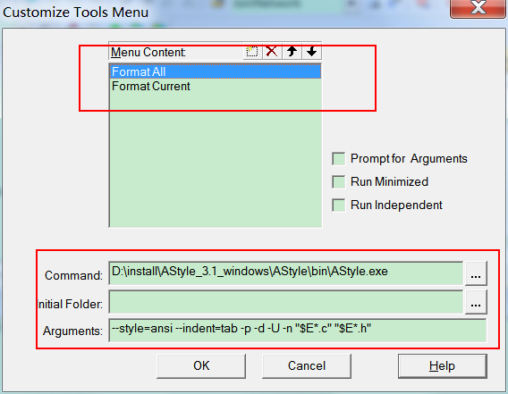
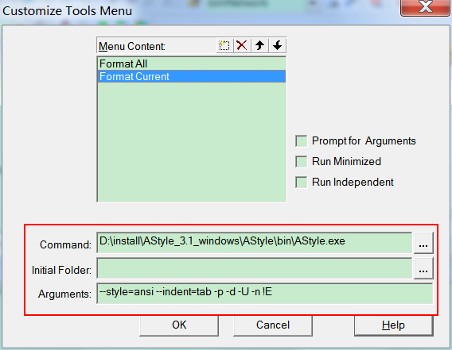
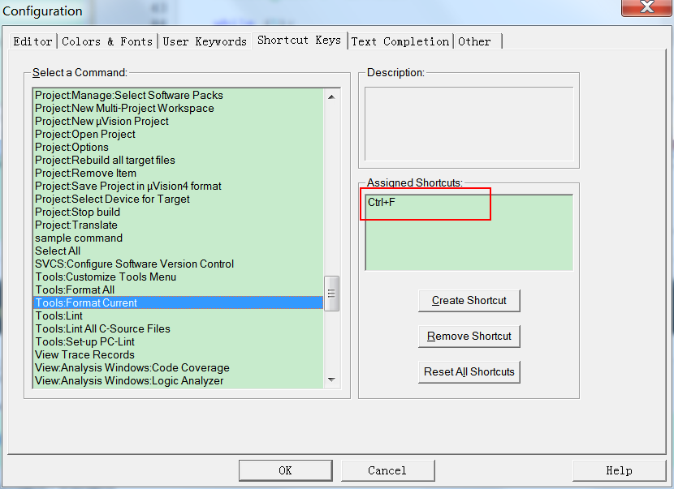
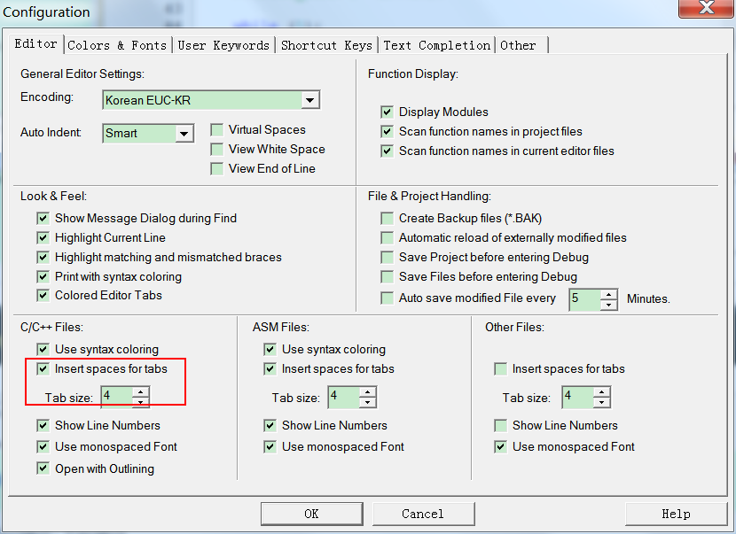

### Keil增加格式化插件AStyle
	找了很多资料，为了增加Keil代码可读性，又不愿意在Keil和其他编辑器切换。所以找到AStyle
#### 1、下载 AStyle最新版本（当前最新版本3.1）

	https://sourceforge.net/projects/astyle/files/astyle/
	下载后解压到某个目录即可
	
#### 2、配置Keil 
	Tools-->Costomize tool menu-->
	增加两个自定义的Menu
	Format All
	 --->Command 配置为 D:\install\AStyle_3.1_windows\AStyle\bin\AStyle.exe
	 --->Arguments 配置为 --style=ansi --indent=tab -p -d -U -n "$E*.c" "$E*.h"

	
	Format Current
	 --->Command 配置为 D:\install\AStyle_3.1_windows\AStyle\bin\AStyle.exe
	 --->Arguments 配置为 --style=ansi --indent=tab -p -d -U -n !E
	

#### 3、增加格式化快捷键Ctrl+F 后自动格式化
	Edit-->Configuration-->Shortcut Keys
	        --->Tool:Format Current 按下Ctrl+F即可，然后OK即可
			

	
	另外：	
	Edit-->Configuration-->Editor
	 	TabSize 全部配置为4
		
